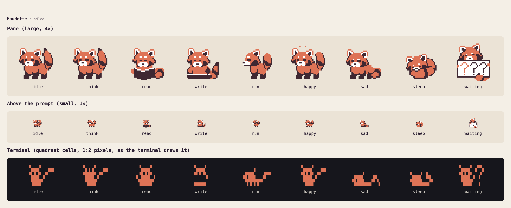
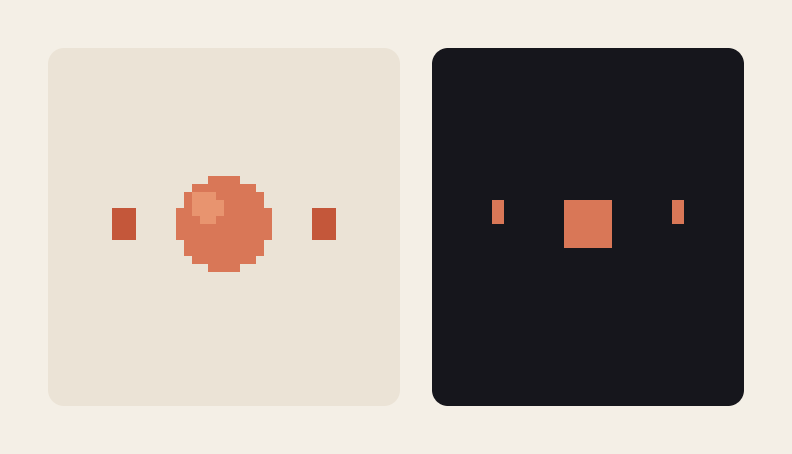
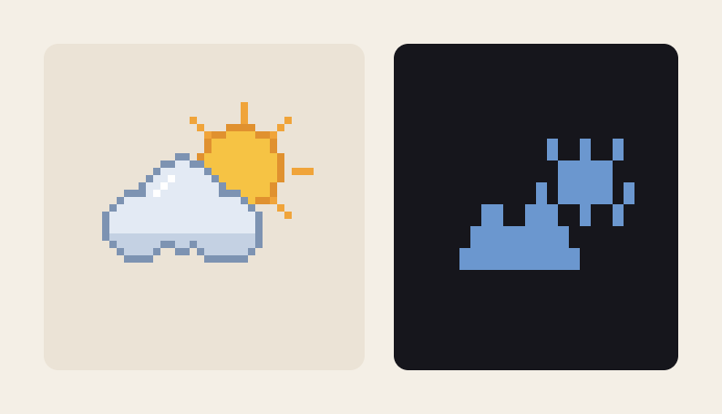
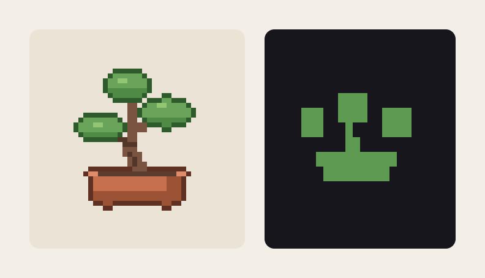

# Maudette

A pixel mascot for Claude Code. They sit above your prompt and react to what Claude is doing: thinking, reading files, writing code, running commands, celebrating a finished turn, or dozing off when things go quiet.



## Install

```bash
claude plugin marketplace add han-sen/maudette
```

```bash
claude plugin install maudette@maudette
```

Start a new session and they appear above the prompt. Type `/maudette` to open a bigger view of them in a side pane.

## Mood hooks

| Mood     | When                                              |
| -------- | ------------------------------------------------- |
| Idle     | Nothing's happening                               |
| Thinking | A turn starts, and between steps                  |
| Reading  | Claude reads, searches or browses                 |
| Writing  | Claude edits a file                               |
| Running  | Claude runs a command                             |
| Happy    | A turn finishes                                   |
| Sad      | Something fails                                   |
| Waiting  | Claude asks you a question, until you answer      |
| Asleep   | 5 minutes of quiet; start typing and they wake up |

Beside them, a short caption says what's happening: "Reading draw.ts…", "Running npm…", "Done!".

## Other mascots

I asked Claude to design and generate a few mascots from scratch after making the first:

- **Orbit**: a core and its satellites, every mood told by motion alone.
- **Nimbus**: a tiny sky whose weather follows the work, from sunshine to a thunderstorm to a night full of stars.
- **Bonsai**: a potted tree that sways, grows, gets watered, blossoms and wilts.

<p>
  
  
  
</p>

To switch, set the plugin's **Mascot** option, then start a new session:

```bash
echo '{"mascot":"orbit"}' | claude plugin configure maudette@maudette --values-stdin
```

Use `orbit`, `nimbus` or `bonsai`, or an empty string (`""`) for Maudette.

### Make your own

A mascot is a set of animations, one per mood. There's tool to export from [Aseprite](https://www.aseprite.org/), or you can use any software to create PNG sprite sheets, compiled into a single `.mascot.json` file. Put it in `~/.claude/mascots/` and set the Mascot option to its name. [docs/making-a-mascot.md](docs/making-a-mascot.md) walks through it.

## Where they work

- **Claude Code desktop app** (the Code tab): above the prompt, and in the `/maudette` pane. This is where they render most consistently since it's drawn as crisp SVGs.
- **Terminals:** iTerm2, Ghostty, kitty, WezTerm, Hyper, and VS Code's integrated terminal. In a very short window the mascot steps aside and shows just their caption.

**Not supported yet:**

- **The VS Code extension's chat panel**, which doesn't draw plugin UI. Run `claude` in VS Code's integrated terminal instead.
- **The Claude mobile app**, which doesn't draw plugin UI either: a session you follow from your phone still has them on your computer, but not on the phone.
- **macOS Terminal**, which draws the block characters they're made of with gaps, so they come out garbled. Use one of the terminals above.

Requires Claude Code 2.1.286 or newer.

## Contributing

How it's built, how to work on it, and the things that are easy to get wrong: [docs/contributing.md](docs/contributing.md).

## License

The code is [MIT](LICENSE) licensed. **Maudette** (the character and their artwork) is licensed separately under [CC BY-NC 4.0](mascots/maudette/LICENSE): you may share and adapt them non-commercially, with credit to Michael Hansen. The other mascots (Orbit, Nimbus, Bonsai) are MIT, like the code.
